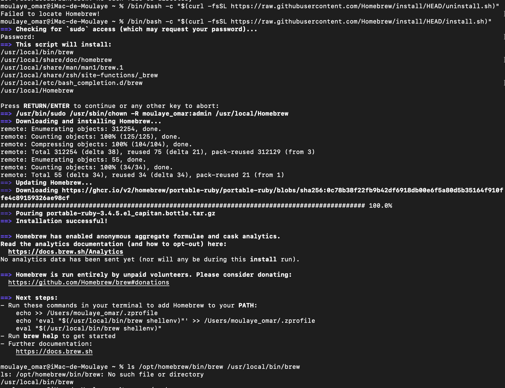
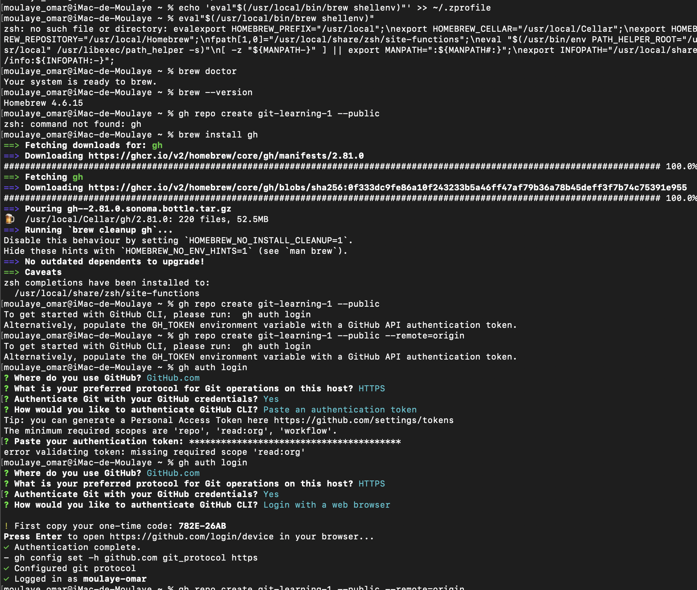
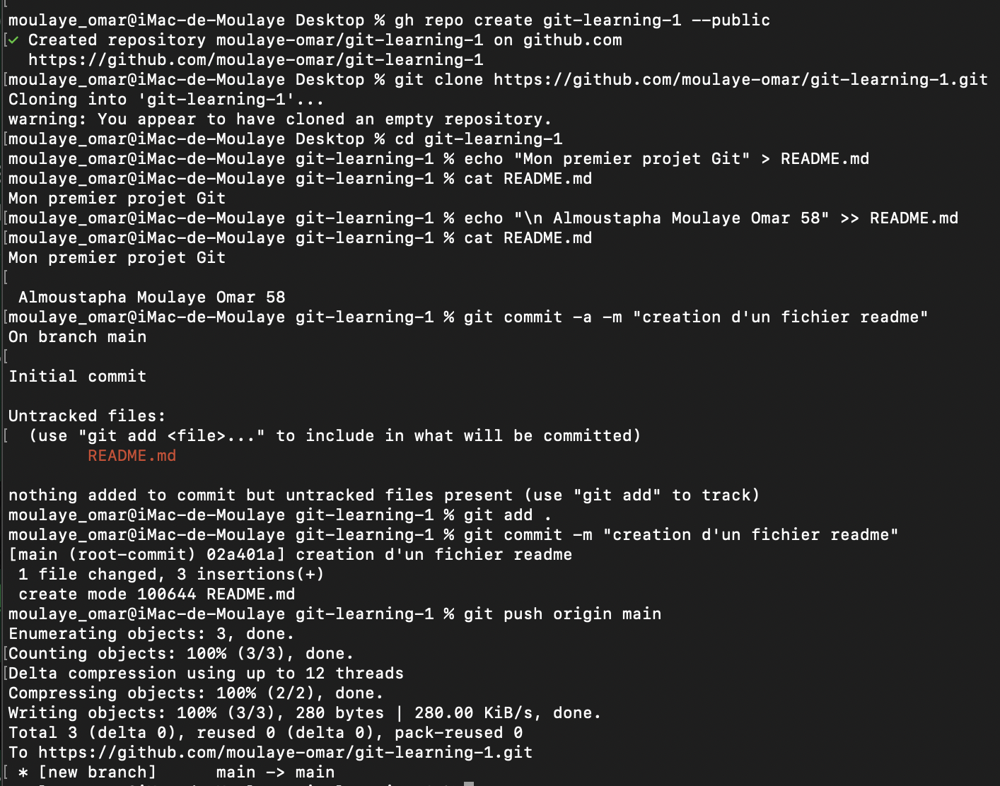

# Git / GitHub
## Exercice N°1
- ### Créez un nouveau repo GitHub appelé git-learning-1.
  -> Pour créer un répertoire git via le terminal on doit d'abord télècharger <b>Homebrew</b>, qui est un gestionnaire de paquets pour macos et Linux(un outil en ligne de commande qui vous permet d'installer, de mettre à jour et de gérer des logiciels facilement depuis votre terminal.).Ce dernier nous permettra de télécharger gh(Github CLI): outil en ligne de commande officiel de GitHub, permet d'interagir avec GitHub directement depuis le terminal. 
 <b>NB:</b>  - n'oublie pas de mettre le chemin du homebrew dans le path(variable d'environnement) pour pouvoir apporter des modifications. - liée votre terminal avec votre compte GitHub
  ### gh repo create git-learning-1 --public  
    
  
- ### Clonez le localement
  ### git clone < lien >
   -> < lien > : le lien du repertoire du GitHub
- ### Créez un fichier README.md with some text (exemple: "Mon premier projet Git")
  -> cd git-learning-1 : il faut accéder au projet avant de créer tout chose.
  ### echo "Mon premier projet Git" > README.md
  -> la redirection (>) permet de verifier si le fichier existe sinon elle le créer ensuite elle ecrase le contenue du fichier afin d'ajouter
  le texte affiché par echo dans le fichier indexé.
- ### Ajoutez une autre ligne au README.md (votre nom et le numéro de votre MAc), puis faites un commit, puis un push final
  ### echo " Nom: Omar \n Num mac: 58" >> README.md
  ### git add README.md
  ### git commit -m "Ajoute de mes informations."
  ### git push -u origin main(nom de la branch)
  -> la double redirection(>>) permet d'ajouter, à chaque changement il faut ajouté avant de commiter pour enfin poussé (mettre sur ton repertoire GitHub)(<b>push</b>)    
  
