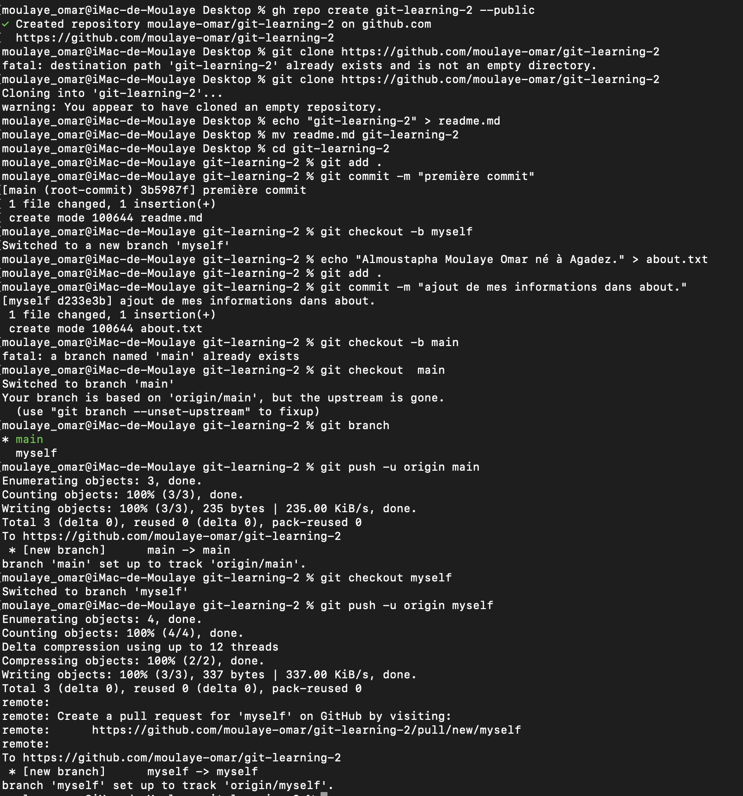
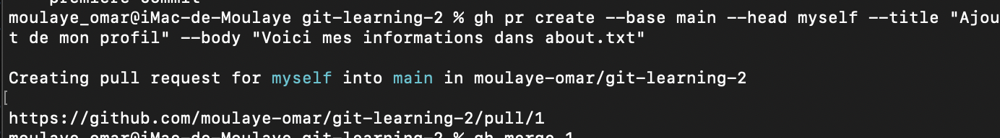

# Git / GitHub
## Exercice N°2
- ### Depuis un repo clonez du nom: git-learning-2 que vous aurez créez créez une nouvelle branche du nom de myself.
  -> On devrait crée le repos github (gh repo create git-learning-2 --public) et ensuite on le clone(git clone < lien >).Avant de creer la branche myself on doit faire une changement sur main pour commiter, plus tard c'est le SHA(identifiant unique généré pour chaque commit) de ce commit qu'on va utilisé pour faire un pull request(qui est une comparaison entre la dernière commit du base(main) et celle du head(mysel)).Pour que ce dernièr marche il faut que les deux branches aient un point de départ commun(au moins un commit). Enfin on crée la branche myself    
  ### git checkout -b myself
- ### Créez un fichier about.txt avec des infos sur vous (nom, prénom, lieu de naissance...)
  ### echo "Almoustapha Moulaye Omar né à Agadez." > about.txt
  -> la redirection (>) permet de verifier si le fichier existe sinon il le créer ensuite elle ecrase le contenue du fichier afin d'ajouter
  le texte affiché par echo dans le fichier indexé.
- ### Faites un commit puis, puis pushez la branche myself.
  ### git add .
  ### git commit -m "ajout de mes information dans about."
  ### git push -u origin myself
  -> à chaque changement il faut ajouté avant de commiter pour enfin poussé (mettre sur ton repertoire GitHub)(<b>push</b>)  
  
- ### Faites un pull request de git-learning-2/myself -> main.
  ### gh pr create --base main --head myself --title "Ajout de mon profil" --body "Voici mes informations dans about.txt"
  -> pull request est une demande pour introduire mes ajout dans la branche main(principal).
- ### Mergez le pull request.
  #### gh pr merge 1 (à travers le numéro du pr)
  #### gh pr merge --head myself (à travers le nom de la branche)
    
  
