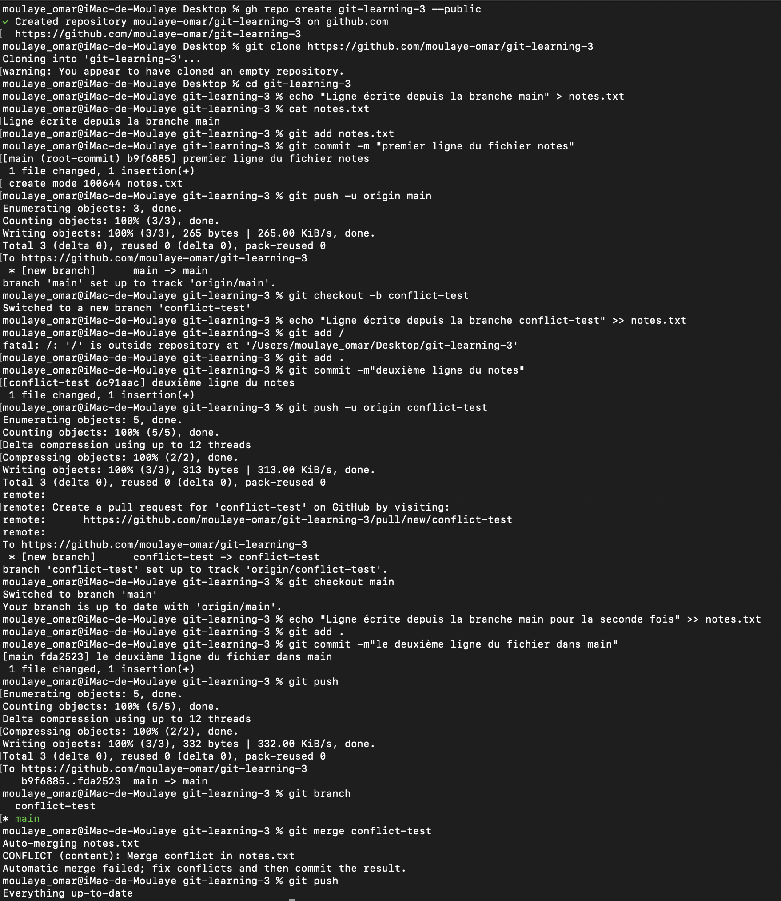

# Git / GitHub
## Exercice N°3
- ### Créez un nouveau repo GitHub appelé git-learning-3.
  #### gh repo create git-learning-3 --public
  -> gh(github cli):outil en ligne de commande officiel de GitHub, permet d'interagir avec GitHub directement depuis le terminal.
- ### Sur la branche main, ajoutez un nouveau fichier notes.txt avec pour contenu "Ligne écrite depuis la branche main".
  #### git clone < lien >
  -> on doit cloner pour pouvoir apporter des modifications localement
  #### cd git-learning-3
  -> on accéde au dossier pour faire des modifications
  #### echo "Ligne écrite depuis la branche main" > notes.txt
  -> la double redirection (>>) permet de verifier si le fichier existe sinon elle le créer puis elle ajouter le texte affiché par echo dans le fichier indexé.
- ### Faites un commit et pushez.
  #### git add notes.txt
  #### git commit -m "premier ligne du fichier notes"
  #### git push -u origin main
  -> à chaque changement il faut ajouté avant de commiter pour enfin poussé (mettre sur ton repertoire GitHub)(<b>push</b>)
- ### Créez une branche conflict-test
  #### git checkout -b conflict-test
  -> <b>checkout</b> permet de deplacer sur une branche et <b>-b</b> permet de creer la branche sur laquel on va se deplacer
- ### Editez note.txt depuis la branche conflict-test et insérez y la phrase "Ligne écrite depuis la branche conflict-test".
  #### echo "Ligne écrite depuis la branche conflict-test" >> notes.txt
   -> la redirection (>) permet de verifier si le fichier existe sinon il le créer ensuite elle ecrase le contenue du fichier afin d'ajouter
  le texte affiché par echo dans le fichier indexé.
- ### Faites un commit et pushez.
  #### git add .
  #### git commit -m "deuxième ligne du notes"
  #### git push -u origin conflict-test
  -> à chaque changement il faut ajouté avant de commiter pour enfin poussé (mettre sur ton repertoire GitHub)(<b>push</b>).
- ### Revenez à la branche main et remodifiez notes.txt différemment avec la phrase "Ligne écrite depuis la branche main pour la seconde fois".
  #### git checkout main
  -> pour se deplacer sur la branche main
  #### echo "Ligne écrite depuis la branche main pour la seconde fois" >> notes.txt
  -> la double redirection (>>) permet de verifier si le fichier existe sinon elle le créer puis elle ajouter le texte affiché par echo dans le fichier indexé.
- ### Faites un commit et pushez.
  #### git add .
  #### git commit -m "le deuxième ligne du fichier dans main"
  #### git push
  -> à chaque changement il faut ajouté avant de commiter pour enfin poussé (mettre sur ton repertoire GitHub)(<b>push</b>).
- ### Essayez de merger la branche conflict-test dans main.
  #### git merge conflict-test
  -> pour merge une branche dans une autre il que tu sois dans la branche qui reçoit(principale) puis tu exécute la commande indiqué ci-haut.
  ##### Après la resolution manuel
  -> aprés chaque modification manuel ou automatique il faut s'assuré d'ajouter(add) ensuit sauvergarder(commit) et enfin poussé(push).
  #### git add .
  #### git commit -m "fusion de deux branches"
  #### git push
    
  